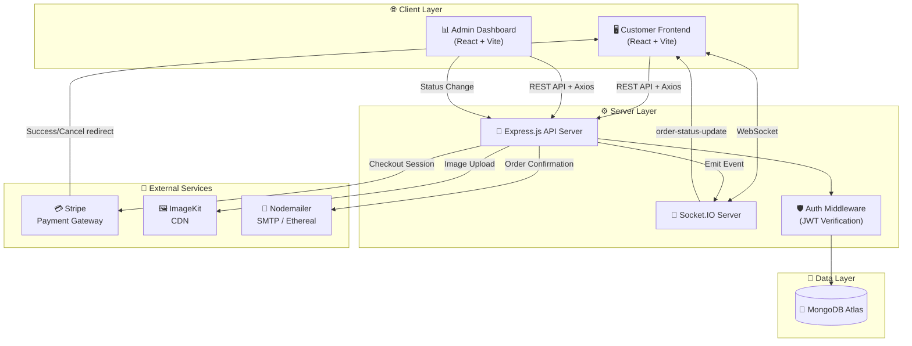
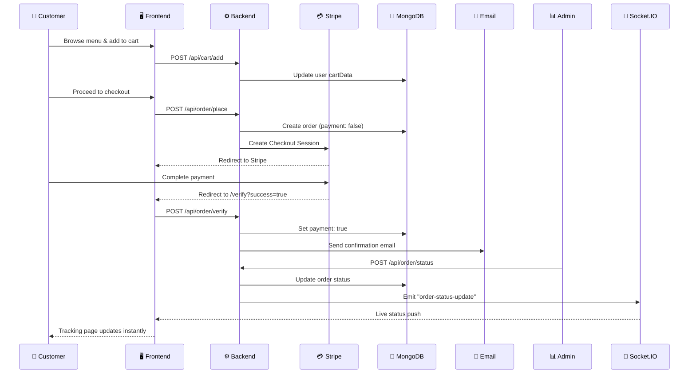
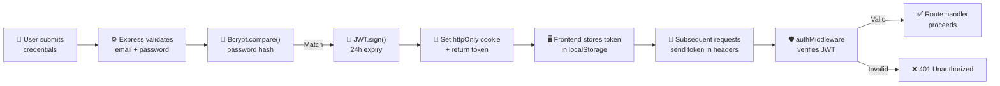

<div align="center">

# 🥘 Cravely — Premium Food Delivery Platform

**A full-stack, real-time food delivery web application with a customer storefront, admin dashboard, and integrated payment processing.**

[](https://react.dev)
[](https://nodejs.org)
[](https://www.mongodb.com)
[](https://stripe.com)
[](https://socket.io)
[](https://vitejs.dev)

[Live Demo →](https://food-delivery-one-tau.vercel.app) · [Report Bug](../../issues) · [Request Feature](../../issues)

</div>

---

## 📋 Table of Contents

- [Project Overview](#-project-overview)
- [Visual Layout & UI Experience](#-visual-layout--ui-experience)
- [Core Features & Benefits](#-core-features--benefits)
- [Architecture Diagram](#-architecture-diagram)
- [Tech Stack & Tools](#-tech-stack--tools)
- [Folder Structure](#-folder-structure)
- [API Reference](#-api-reference)
- [Security & Authentication](#-security--authentication)
- [Setup & Installation](#-setup--installation)
- [Environment Variables](#-environment-variables)
- [Deployment](#-deployment)
- [Contributing](#-contributing)
- [License](#-license)

---

## 🚀 Project Overview

**Cravely** is a production-grade food delivery platform designed to provide a seamless end-to-end experience — from browsing a curated food menu, to placing an order, processing secure payments, and tracking delivery in real time.

### The Problem It Solves

Traditional food ordering is fragmented — customers juggle phone calls, inconsistent menus, and zero visibility into delivery status. Restaurant owners lack insights into revenue, popular dishes, or order efficiency.

### The Cravely Solution

Cravely unifies the entire food ordering lifecycle into a single, premium web experience:

- **Customers** get a modern, responsive storefront with smooth animations, real-time order tracking via WebSockets, and secure Stripe-powered payments.
- **Restaurant Admins** get a dedicated dashboard with analytics (revenue trends, top dishes, user counts), inventory management, and real-time order status control that pushes live updates to customers.
- **Restaurant Sellers** can register independently and manage their catalog through the admin panel.

Built with a modern **MERN stack** (MongoDB, Express, React, Node.js) and enhanced with **Socket.IO** for live updates, **ImageKit CDN** for optimized image delivery, and **Nodemailer** for transactional email receipts.

---

## 🎨 Visual Layout & UI Experience

Cravely is designed to feel premium at every touchpoint. Here's the user journey:

### 🏠 Landing Experience
The app opens with an **animated preloader** featuring the Cravely brand logo with pulsing rings and a smooth progress bar. After the preloader fades out, users land on a full-screen hero section with:
- Floating food emoji animations (🍕 🍔 🍜 🥗)
- Dynamic stat counters (1000+ Happy Customers, 500+ Dishes, 4.8★ Rating)
- Gradient call-to-action buttons with hover micro-animations
- A **sticky, glassmorphic navbar** that transforms on scroll

### 🍴 Menu Exploration
- Horizontally scrollable **category filter** with icons (Salad, Rolls, Deserts, etc.)
- **Food cards** with CDN-optimized images, add-to-cart buttons with quantity controls
- Smooth **Lenis-powered scroll** for a buttery browsing experience

### 🛒 Cart & Checkout
- Itemized cart with real-time total calculation and delivery fee breakdown
- Full delivery address form with client-side validation
- **Stripe Checkout** redirect for PCI-compliant payment processing

### 📦 Real-Time Order Tracking
- **Visual stepper** (Food Processing → Out for Delivery → Delivered)
- **Live WebSocket updates** — status changes made by the admin instantly reflect on the customer's tracking page
- Glassmorphic card design with pulse-animated delivery icon

### 🛡️ Server Wakeup Handler
- On Render's free tier, the backend may cold-start. Cravely detects slow API responses (>5s) and shows a premium **Server Wakeup overlay** with cycling status messages, elapsed timer, and a shimmer progress bar — ensuring users never see a broken screen.

### 📊 Admin Dashboard
- **Recharts-powered analytics**: Revenue trend line charts and top-5 popular dishes bar charts
- **Glassmorphism metric cards** showing Total Revenue, Total Orders, and Total Users
- **Order management** with dropdown status updates that push via Socket.IO

---

## ✨ Core Features & Benefits

| Technical Feature | User Benefit |
|---|---|
| **Stripe Payment Integration** | Secure, PCI-compliant card payments with automatic redirect flow |
| **Socket.IO Real-Time Updates** | Customers see order status changes live without refreshing |
| **JWT Authentication** | Secure, stateless user sessions with 24-hour token expiry |
| **Bcrypt Password Hashing** | User passwords are never stored in plaintext |
| **ImageKit CDN** | Food images load instantly via global CDN with auto-optimization |
| **Nodemailer Email Receipts** | Users receive styled HTML order confirmation emails after payment |
| **Recharts Analytics Dashboard** | Admins visualize revenue trends and popular dishes at a glance |
| **Lenis Smooth Scrolling** | Buttery-smooth page scrolling that feels native and premium |
| **Role-Based Access Control** | Separate `user`, `seller`, and `admin` roles with distinct permissions |
| **Optimistic Cart Updates** | Cart changes feel instant — synced to server in background with rollback |
| **Cold-Start Detection** | Intelligent server wakeup overlay prevents user confusion on free-tier hosting |
| **Responsive Design** | Fully optimized for mobile (480px), tablet (768px), and desktop |
| **Animated Preloader** | Premium brand loading experience with pulsing animations |
| **Multer In-Memory Upload** | Images upload directly to CDN without touching server disk |

---

## 🏗️ Architecture Diagram



### Data Flow: Order Lifecycle



---

## 🛠️ Tech Stack & Tools

### Frontend

| Technology | Purpose |
|---|---|
| **React 18** | Component-based UI with hooks and context API |
| **Vite 5** | Lightning-fast dev server and optimized production builds |
| **React Router v6** | Client-side routing with nested routes |
| **Axios** | HTTP client with interceptors and centralized configuration |
| **Socket.IO Client** | Real-time WebSocket communication |
| **Lenis** | Ultra-smooth scroll library for premium UX |
| **React Toastify** | Toast notifications for user feedback |
| **Stripe.js** | Secure client-side payment integration |
| **Outfit Font** | Modern Google Font for consistent typography |

### Backend

| Technology | Purpose |
|---|---|
| **Node.js** | JavaScript runtime for server-side logic |
| **Express.js** | Minimal web framework for REST API routing |
| **Socket.IO** | Bidirectional real-time event-based communication |
| **Mongoose** | ODM for MongoDB with schema validation |
| **JSON Web Tokens** | Stateless authentication with signed tokens |
| **Bcrypt** | Industry-standard password hashing (10 salt rounds) |
| **Multer** | Multipart form-data parsing with in-memory storage |
| **Stripe SDK** | Server-side payment processing and checkout sessions |
| **ImageKit SDK** | Cloud image upload, optimization, and CDN delivery |
| **Nodemailer** | Email delivery with SMTP and Ethereal fallback |
| **Validator** | Input validation for emails, strings, and more |

### Admin Panel

| Technology | Purpose |
|---|---|
| **React 18** | Dedicated SPA for restaurant management |
| **Recharts** | Composable charting library (line, bar charts) |
| **Axios** | REST API communication with backend |
| **React Toastify** | Admin notification system |

### Database & DevOps

| Technology | Purpose |
|---|---|
| **MongoDB Atlas** | Cloud-hosted NoSQL database |
| **Vercel** | Frontend deployment with SPA rewrites |
| **Render** | Backend deployment with WebSocket support |
| **ImageKit** | Global CDN for food images |
| **Nodemon** | Auto-restart dev server on file changes |

---

## 📂 Folder Structure

```
Food-delivery/
│
├── 📁 frontend/                    # Customer-facing storefront (Vite + React)
│   ├── index.html                  # SPA entry point
│   ├── vercel.json                 # Vercel SPA rewrite rules
│   ├── vite.config.js              # Vite build configuration
│   └── src/
│       ├── main.jsx                # React root with BrowserRouter & Context
│       ├── App.jsx                 # Top-level routes, preloader, & navbar
│       ├── index.css               # Global styles, reset, typography
│       │
│       ├── 📁 api/
│       │   └── client.js           # Axios instance with interceptors & baseURL
│       │
│       ├── 📁 context/
│       │   └── StoreContext.jsx     # Global state (cart, auth, food list, server status)
│       │
│       ├── 📁 components/
│       │   ├── Navbar/             # Sticky navbar with mobile overlay & profile dropdown
│       │   ├── Header/             # Hero section with floating animations & CTA
│       │   ├── ExploreMenu/        # Category filter with horizontal scroll
│       │   ├── FoodDisplay/        # Food grid filtered by selected category
│       │   ├── FoodItem/           # Individual food card with add-to-cart
│       │   ├── LoginPopup/         # Auth modal (Login/Sign Up) with validation
│       │   ├── AdminAuthPopup/     # Seller registration popup
│       │   ├── About/              # About section
│       │   ├── AppDownload/        # App download CTA section
│       │   ├── Footer/             # Site footer with links & social
│       │   ├── Preloader/          # Animated brand loading screen
│       │   └── ServerWakeup/       # Cold-start detection overlay for Render
│       │
│       ├── 📁 pages/
│       │   ├── Home/               # Landing page (Header + Menu + Food + About)
│       │   ├── Cart/               # Cart management with totals
│       │   ├── PlaceOrder/         # Delivery form + Stripe checkout
│       │   ├── Verify/             # Payment verification redirect handler
│       │   ├── MyOrders/           # User order history
│       │   └── TrackOrder/         # Real-time order tracking with stepper
│       │
│       └── 📁 assets/              # Static images, icons, and menu data
│
├── 📁 admin/                       # Restaurant admin dashboard (Vite + React)
│   └── src/
│       ├── App.jsx                 # Admin routing (Dashboard, Add, List, Orders)
│       ├── 📁 pages/
│       │   ├── Dashboard/          # Analytics: revenue charts, top dishes, KPIs
│       │   ├── Add/                # Add new food items with image upload
│       │   ├── List/               # Manage food catalog (view/delete)
│       │   └── Orders/             # Order management with status updates
│       └── 📁 components/
│           ├── Navbar/             # Admin top navigation bar
│           └── Sidebar/            # Admin side menu navigation
│
└── 📁 backend/                     # Node.js + Express REST API
    ├── server.js                   # App bootstrap: Express, CORS, Socket.IO, routes
    ├── package.json                # Dependencies and scripts
    │
    ├── 📁 config/
    │   └── db.js                   # MongoDB Atlas connection via Mongoose
    │
    ├── 📁 models/
    │   ├── userModel.js            # User schema (username, email, password, role, cart)
    │   ├── foodModel.js            # Food schema (name, price, category, image, imageFileId)
    │   └── orderModel.js           # Order schema (userId, items, amount, address, status)
    │
    ├── 📁 controllers/
    │   ├── userController.js       # Register (user/seller), login, logout
    │   ├── foodController.js       # CRUD food items with ImageKit upload/delete
    │   ├── cartController.js       # Add, remove, get cart items
    │   ├── orderController.js      # Place order, verify payment, update status
    │   └── analyticsController.js  # Revenue, orders, users, top dishes, trends
    │
    ├── 📁 routes/
    │   ├── userRoute.js            # /api/user/* and /api/seller/* endpoints
    │   ├── foodRoute.js            # /api/food/* endpoints with multer middleware
    │   ├── cartRoute.js            # /api/cart/* endpoints (auth protected)
    │   ├── orderRoute.js           # /api/order/* endpoints (auth protected)
    │   └── analyticsRoute.js       # /api/analytics endpoint
    │
    ├── 📁 middleware/
    │   └── auth.js                 # JWT verification middleware
    │
    ├── 📁 utils/
    │   ├── emailService.js         # Nodemailer transporter with Ethereal fallback
    │   └── imagekit.js             # ImageKit SDK initialization
    │
    └── 📁 uploads/                 # Temporary file storage (legacy, now uses in-memory)
```

---

## 📡 API Reference

### Authentication

| Method | Endpoint | Description | Auth |
|---|---|---|---|
| `POST` | `/api/user/register` | Register a new customer account | ❌ |
| `POST` | `/api/user/login` | Login with email/username + password | ❌ |
| `POST` | `/api/seller/register` | Register a seller/admin account | ❌ |
| `POST` | `/api/seller/login` | Login as seller | ❌ |
| `POST` | `/api/logout` | Clear auth cookie and logout | ❌ |

### Food Menu

| Method | Endpoint | Description | Auth |
|---|---|---|---|
| `GET` | `/api/food/list` | List all food items | ❌ |
| `POST` | `/api/food/add` | Add food item (multipart w/ image) | ❌ |
| `POST` | `/api/food/remove` | Delete a food item + CDN image | ❌ |

### Cart

| Method | Endpoint | Description | Auth |
|---|---|---|---|
| `POST` | `/api/cart/add` | Add item to user's cart | ✅ |
| `POST` | `/api/cart/remove` | Remove item from user's cart | ✅ |
| `POST` | `/api/cart/get` | Get user's current cart | ✅ |

### Orders

| Method | Endpoint | Description | Auth |
|---|---|---|---|
| `POST` | `/api/order/place` | Create order + Stripe checkout session | ✅ |
| `POST` | `/api/order/verify` | Verify payment and confirm/delete order | ❌ |
| `POST` | `/api/order/userorders` | Get all orders for logged-in user | ✅ |
| `GET` | `/api/order/list` | Get all orders (admin) | ❌ |
| `POST` | `/api/order/status` | Update order status (admin) | ❌ |

### Analytics

| Method | Endpoint | Description | Auth |
|---|---|---|---|
| `GET` | `/api/analytics` | Get dashboard analytics data | ❌ |

### WebSocket Events

| Event | Direction | Payload | Description |
|---|---|---|---|
| `order-status-update` | Server → Client | `{ orderId, status }` | Pushed when admin changes order status |

---

## 🛡️ Security & Authentication

### Authentication Flow



### Security Measures

| Layer | Implementation |
|---|---|
| **Password Storage** | Bcrypt hashing with **10 salt rounds** — passwords are never stored or logged in plaintext |
| **Token Authentication** | JWT tokens signed with `JWT_SECRET`, expire after **24 hours** |
| **Cookie Security** | `httpOnly: true`, `secure: true` in production, `sameSite: "None"` for cross-origin |
| **Session Expiration** | 401 responses trigger `session-expired` custom event, clearing all stored credentials |
| **Input Validation** | Server-side validation via `validator` library (email format, password length ≥ 6) |
| **Password Visibility** | Frontend toggle doesn't store state — field type switches between `password` and `text` |
| **CORS Policy** | White-listed origins only (`localhost:5173`, `localhost:5174`, Vercel production domain) |
| **File Upload Safety** | Multer uses **in-memory storage** — uploaded files never touch the server filesystem |
| **Role-Based Access** | User model supports `user`, `seller`, and `admin` roles with `enum` enforcement |
| **XSS Protection** | React's JSX auto-escapes rendered content by default |

---

## ⚡ Setup & Installation

### Prerequisites

| Requirement | Version |
|---|---|
| **Node.js** | v18+ recommended |
| **npm** | v9+ |
| **MongoDB** | Atlas cloud instance (free tier works) |
| **Stripe Account** | For payment processing (test mode available) |
| **ImageKit Account** | For image CDN (free tier: 20 GB/month) |

### 1️⃣ Clone the Repository

```bash
git clone https://github.com/your-username/Food-delivery.git
cd Food-delivery
```

### 2️⃣ Install Dependencies

```bash
# Backend
cd backend
npm install

# Frontend (new terminal)
cd ../frontend
npm install

# Admin (new terminal)
cd ../admin
npm install
```

### 3️⃣ Configure Environment Variables

Create a `.env` file in the `backend/` directory:

```env
# Database
MOGODB_URL=mongodb+srv://<username>:<password>@<cluster>.mongodb.net/<dbname>

# Authentication
JWT_SECRET=your_jwt_secret_key_here

# Stripe
STRIPE_SECRET_KEY=sk_test_your_stripe_secret_key

# ImageKit CDN
IMAGEKIT_PUBLIC_KEY=public_your_imagekit_public_key
IMAGEKIT_PRIVATE_KEY=private_your_imagekit_private_key
IMAGEKIT_URL_ENDPOINT=https://ik.imagekit.io/your_id

# Email (Optional — falls back to Ethereal mock if omitted)
SMTP_HOST=smtp.gmail.com
SMTP_PORT=465
SMTP_USER=your_email@gmail.com
SMTP_PASS=your_app_password
SMTP_FROM="Cravely Updates" <noreply@cravely.com>
```

### 4️⃣ Start Development Servers

```bash
# Terminal 1 — Backend (port 4000)
cd backend
npm run dev

# Terminal 2 — Frontend (port 5173)
cd frontend
npm run dev

# Terminal 3 — Admin Panel (port 5174)
cd admin
npm run dev
```

### 5️⃣ Access the Application

| Application | URL |
|---|---|
| 🖥️ Customer Frontend | [http://localhost:5173](http://localhost:5173) |
| 📊 Admin Dashboard | [http://localhost:5174](http://localhost:5174) |
| ⚙️ Backend API | [http://localhost:4000](http://localhost:4000) |

---

## 🔑 Environment Variables

| Variable | Required | Description |
|---|---|---|
| `MOGODB_URL` | ✅ | MongoDB Atlas connection string |
| `JWT_SECRET` | ✅ | Secret key for signing JWT tokens |
| `STRIPE_SECRET_KEY` | ✅ | Stripe secret key (use `sk_test_` for development) |
| `IMAGEKIT_PUBLIC_KEY` | ✅ | ImageKit public API key |
| `IMAGEKIT_PRIVATE_KEY` | ✅ | ImageKit private API key |
| `IMAGEKIT_URL_ENDPOINT` | ✅ | ImageKit CDN endpoint URL |
| `SMTP_HOST` | ❌ | SMTP server hostname (default: `smtp.gmail.com`) |
| `SMTP_PORT` | ❌ | SMTP port (default: `465`) |
| `SMTP_USER` | ❌ | SMTP email address for sending emails |
| `SMTP_PASS` | ❌ | SMTP password or app-specific password |
| `SMTP_FROM` | ❌ | Sender display name and email |

> **💡 Note:** If `SMTP_USER` and `SMTP_PASS` are not set, the email service automatically falls back to [Ethereal](https://ethereal.email/) mock emails. Preview URLs are logged to the console — perfect for development.

---

## 🌍 Deployment

### Frontend → Vercel

1. Push `frontend/` to a GitHub repo
2. Import in [vercel.com](https://vercel.com) → select `frontend` as root directory
3. Framework preset: **Vite**
4. The `vercel.json` SPA rewrite is included automatically

### Backend → Render

1. Push `backend/` to a GitHub repo
2. Create a **Web Service** on [render.com](https://render.com)
3. Set **Build Command**: `npm install`
4. Set **Start Command**: `npm start`
5. Add all environment variables from the `.env` section above

### Admin → Vercel / Netlify

1. Deploy similarly to the frontend
2. Set root directory to `admin/`
3. No special configuration needed

> **⚠️ Note:** Render's free tier puts the server to sleep after 15 minutes of inactivity. Cravely includes a built-in **Server Wakeup overlay** that detects cold starts and shows a user-friendly loading screen while the server boots up (~30-50 seconds).

---

## 🤝 Contributing

Contributions are welcome! Please follow these steps:

1. **Fork** the repository
2. **Create** a feature branch (`git checkout -b feature/amazing-feature`)
3. **Commit** your changes (`git commit -m 'Add amazing feature'`)
4. **Push** to the branch (`git push origin feature/amazing-feature`)
5. **Open** a Pull Request

### Guidelines

- Follow existing code style and component patterns
- Use the centralized `api/client.js` for all HTTP requests
- Keep components in their own directories with co-located CSS
- Test on mobile viewports before submitting UI changes

---

## 📄 License

This project is open source and available under the [MIT License](LICENSE).

---

<div align="center">

**Built with ❤️ by Cravely Team**

⭐ Star this repo if you found it useful!

</div>
